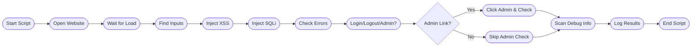

# Automation Advocates Workshop: Intelligent UI Automation with AskUI

| [](https://github.com/ma3u/askui-automation-workshop) | **Welcome to the Automation Advocates hands-on workshop!**<br><br>In this session, you'll embark on a journey from the basics of UI automation to advanced, AI-driven use cases with AskUI.<br><br>Whether you're just starting out or looking to push the boundaries of automation, this workshop will equip you with the knowledge and practical skills to automate smarter.<br><br>**Scan to visit the GitHub repository:**<br>[https://github.com/ma3u/askui-automation-workshop](https://github.com/ma3u/askui-automation-workshop)<br><br>Join us as we:<ul><li>Explore the evolution from traditional RPA to intelligent, vision-based automation</li><li>Learn the fundamentals of AskUI and its open-source ecosystem</li><li>Build real-world automation scripts together</li><li>Dive into advanced use cases, including security testing and agent-based automation</li></ul>For event details, visit the <a href="https://www.meetup.com/de-DE/automation-advocates/events/307565278/">Automation Advocates Meetup page</a>. |
|:---:|:---|

---

## Table of Contents

- [Introduction](#introduction)
- [What is AskUI?](#what-is-askui)
- [Why Intelligent UI Automation?](#why-intelligent-ui-automation)
- [Getting Started with AskUI](#getting-started-with-askui)
- [Workshop Examples](#workshop-examples)
- [Advanced Use Case: Security Testing](#advanced-use-case-security-testing)
- [Team & Community](#team--community)
- [Resources](#resources)

---

## Introduction

Automation is evolving. Traditional rule-based bots are giving way to intelligent, adaptive agents that can understand and interact with software just like humans do. In this workshop, we'll see how AskUI is leading this transformation with its vision-driven, AI-powered approach to UI automation.

## What is AskUI?

[AskUI](https://www.askui.com/) is an open-source platform for intelligent UI automation. Unlike conventional RPA tools, AskUI uses computer vision and natural language to automate any application—web or desktop—without relying on brittle selectors or templates.

- [Source code on GitHub](https://github.com/askui/askui)
- [Documentation](https://docs.askui.com/introduction/01-introduction/01-overview)


## Why Intelligent UI Automation?

- Works across any UI, regardless of underlying technology
- Adapts to UI changes and visual differences
- Enables automation of complex, cognitive tasks
- Bridges the gap between human intent and machine execution

## Getting Started with AskUI

To follow along with the workshop:

```bash
python3 -m venv venv
source venv/bin/activate
pip install askui
```

See the [AskUI documentation](https://docs.askui.com/introduction/01-introduction/01-overview) for detailed setup instructions.

## Workshop Examples

### 1. Game: Tic Tac Toe
Automate playing [Tic Tac Toe](https://playtictactoe.org/) using AskUI's vision agent and natural language prompts.

### 2. Water Tank System Simulation
Control and monitor a simulated water tank system, demonstrating AskUI's ability to interact with industrial UIs.

## Our Idea: Web Security Testing

See how AskUI can be used to automate UI-driven security checks, such as the [OWASP Top 10 Web Application Security Risks](https://owasp.org/www-project-top-ten/). The included script, `askui-owasp-check.ts`, demonstrates automated payload injection, error detection, and access control checks.


## Team & Community

- [Dominik Klotz](https://www.linkedin.com/in/dominik-klotz-127a931b7/)
- [Katharina Kumpers](https://www.linkedin.com/in/katharinakuempers/)
- [Ardit Dvorani](https://www.linkedin.com/in/ardit-dvorani-463592141/)

## Resources

- [AskUI Website](https://www.askui.com/)
- [GitHub Repository](https://github.com/askui/askui)
- [Documentation](https://docs.askui.com/introduction/01-introduction/01-overview)
- [Automation Advocates Meetup](https://www.meetup.com/de-DE/automation-advocates/events/307565278/)

## RPA 2.0 (Robotics Process Automation)

RPA 2.0 represents a paradigm shift from rule-based to intelligence-driven automation. While RPA 1.0 focused on automating repetitive tasks, RPA 2.0 incorporates intelligence and cognitive capabilities that enable more complex automation scenarios.

## AI Computer Agent Comparison Matrix

| Feature | AskUI Vision Agent | Computer Use by Anthropic | Operator by OpenAI | Browser Use | Custom (VLM + PyAutoGUI + Playwright) | Amazon Nova Act | Adept AI's ACT-1 |
|---------|-------------------|--------------------------|-------------------|------------|-------------------------------------|----------------|----------------|
| Browser Use | ✅ | ✅ | ✅ | ✅ | ✅ | ✅ | ✅ |
| DOM Support | ❌ | ❌ | ✅ | ✅ | ✅ | ✅ | ❌ |
| Windows Use | ✅ | ✅ | ❌ | ❌ | ✅ | ❌ | ✅ |
| Linux Use | ✅ | ✅ | ❌ | ❌ | ✅ | ✅ | ❌ |
| MacOS Use | ✅ | ✅ | ❌ | ❌ | ✅ | ✅ | ❌ |
| Android Use | ✅ | ❌ | ❌ | ❌ | ❌ | ❌ | ❌ |
| iOS Use | ✅ | ❌ | ❌ | ❌ | ❌ | ❌ | ❌ |
| In-Background Automation | ✅ | ❌ | ❌ | ❌ | ❌ | ✅ | ❌ |
| Change Detection (Automatic waits) | ✅ | ❌ | ❌ | ❌ | ❌ | ✅ | ❌ |
| Multi-Screen Support | ✅ | ❌ | ❌ | ❌ | ❌ | ❌ | ❌ |
| Multi-Device Support | ✅ | ❌ | ❌ | ❌ | ❌ | ❌ | ❌ |
| Intent-based Prompting | ✅ | ✅ | ✅ | ❌ | ✅ | ✅ | ✅ |
| Single-step Commands | ✅ | ❌ | ❌ | ❌ | ❌ | ✅ | ❌ |
| Human-in-the-Loop | ✅ | ✅ | ✅ | ❌ | ❌ | ✅ | ✅ |
| Prompting Interface | Python, TypeScript | Chat | Chat | Python | Custom | Python | Chrome Extension |
| Enterprise Installer | ✅ | ❌ | ❌ | ❌ | ❌ | ❌ | ❌ |
| On-Premise Availability | ✅ | ❌ | ❌ | ❌ | ✅ | ✅ | ❌ |
| Model Control Protocol | ❌soon | ❌ | ❌ | ❌ | ✅ | ❌ | ❌ |

---
## AI Agent - Different Levels of Agencies

| Agency Level | Description                                                        | What’s that’s called   | Example pattern                                   |
|--------------|--------------------------------------------------------------------|------------------------|---------------------------------------------------|
| ☆☆☆         | Agent output has no impact on program flow                         | Simple processor       | `process_llm_output(llm_response)`                |
| ☆☆★         | Agent output determines basic control flow                         | Router                 | `if llm_decision(): path_a() else: path_b()`      |
| ☆★★         | Agent output determines function execution                         | Tool caller            | `run_function(llm_chosen_tool, llm_chosen_args)`  |
| ★★★         | Agent output controls iteration and program continuation           | Multi-step Agent       | `while llm_should_continue(): execute_next_step()`|
| ★★★★        | One agentic workflow can start another agentic workflow            | Multi-Agent            | `if llm_trigger(): execute_agent()`               |


## Model List

| Grounding Model          | Query Model                                                                                  | Large Action Model           |
|--------------------------|---------------------------------------------------------------------------------------------|------------------------------|
| [AskUI UIDT-1](#)        | [OpenAI VLMs](#)<br>&nbsp;&nbsp;a. [o1](#)<br>&nbsp;&nbsp;b. [GPT-4o](#)<br>&nbsp;&nbsp;c. [GPT-4o-mini](#)<br>&nbsp;&nbsp;d. [GPT-4 Turbo](#)<br>[Antrophic VL](#)<br>[Deepseek VL](#)<br>[Qween VL](#) | [Computer User](#)<br>[UI Tars 1.5](#)<br>[UI-R1](#)<br>[Computer Using Agent](#) |
| [AskUI PTA-1](#)         |                                                                                             |                              |
---
## UI Models


---
## Examples

### 1. Game: Tic Tac Toe
https://playtictactoe.org/

This is the Agent PROMPT:
```python
def tests_winning_in_Tic_Tac_Toe(agent: VisionAgent):
    agent.tools.webbrowser.open_new("https://playtictactoe.org/")

    # Start to automate individual steps
    time.sleep(5)

    agent.act("""
Everytime you make a move, wait 2 seconds before you continue.
You are playing a Tic Tac Toe game as player X. Follow these strategic rules:

1. First Move Strategy:
    - Always take the center if available
    - If center is taken, take a corner

2. Winning Strategy (in priority order):
    a) Win: Complete any line with two X's
    b) Block: Stop opponent's two-in-a-row
    c) Fork: Create multiple winning paths
    d) Defense: Take opposite corner if opponent has corner, or side middle if they have two corners

3. Game Flow:
    - After each move, wait for opponent's move
    - Verify the opponent's move is complete before proceeding
    - If you lose click in the center of the board to reset the game.

4. Error Handling:
    - If any popups appear, close them immediately
    - If the game freezes, refresh the page
    """)
```


### 2. Water Tank System Simulation


```python
import subprocess

def tests_water_tank_manual_slider_test(agent: VisionAgent):
    agent.act("""
wait until you see the screen is fully loaded.
You are currently looking at a PLC screen.
You are in Manual mode.
You need to pull the manual tank level to 50%
""")
    is_equal = agent.get("Is the Handle of the slider equal the percentage of the water tank level?", response_schema=bool)
    if is_equal:
        subprocess.run(["echo", "✓ Slider and water tank levels are synchronized"])
    else:
        subprocess.run(["echo", "✗ Slider and water tank levels are not synchronized"])
    assert is_equal, "The slider is not at the correct level"

def tests_auto_mode(agent: VisionAgent):
    agent.act("""
wait until you see the screen is fully loaded.
You are currently looking at a PLC screen.
You have to activate auto mode.
Now you need to click on Stop Pump
Wait until it reaches 0%
If there is a pop up, simulate closing it.
""")
    is_equal = agent.get("Is the Handle of the slider equal the percentage of the water tank level?", response_schema=bool)
    if is_equal:
        subprocess.run(["echo", "✓ Slider and water tank levels are synchronized"])
    else:
        subprocess.run(["echo", "✗ Slider and water tank levels are not synchronized"])
    assert is_equal, "The slider is not at the correct level"
```

## Use Case: Automated OWASP Top 10 Security Checks for Web Applications

This project demonstrates how to use AskUI for automated UI-driven security checks on a web application, specifically targeting the [OWASP Top 10 Web Application Security Risks](https://owasp.org/www-project-top-ten/). The included script, `askui-owasp-check.ts`, automates browser actions to:

---

### Process Overview (Mermaid Diagram)



---

- Open a specified website (e.g., https://mabu.red/)
- Attempt to inject common XSS and SQLi payloads in visible input fields
- Look for error messages, debug traces, or misconfiguration indicators in the UI
- Detect the presence of login/logout and admin links, and attempt to access restricted areas
- Provide console output for any detected issues or confirmations

### Why Use AskUI for Security Checks?
AskUI is a visual automation tool that interacts with web applications as a user would, making it possible to:
- Automate repetitive security test scenarios
- Simulate basic attacks and observe UI responses
- Rapidly check for visible signs of common vulnerabilities

While AskUI cannot replace dedicated security scanners, it is useful for continuous integration pipelines and basic regression security checks.

### How the Script Works
The `askui-owasp-check.ts` script performs the following steps:

1. **Opens the target website** and waits for it to load.
2. **Inputs XSS and SQLi payloads** into all detected textboxes and submits them, checking for any visible alerts or errors.
3. **Scans for error messages** or debug information that may indicate security misconfigurations.
4. **Detects login/logout and admin links** to highlight potential authentication or access control issues.
5. **Attempts to access admin areas** if links are present, checking for proper restriction.
6. **Logs all findings to the console** for review.

> Note: Some security checks (like cookie flags, HTTP headers, or backend vulnerabilities) are not possible with UI automation alone and require specialized tools.

## Installation

```bash
python3 -m venv venv
source venv/bin/activate
pip install askui
```
