# Automation Advocates Workshop: Intelligent UI Automation with AskUI

| [](https://github.com/ma3u/askui-automation-workshop) | **Welcome to the Automation Advocates hands-on workshop!**<br><br>In this session, you'll embark on a journey from the basics of UI automation to advanced, AI-driven use cases with AskUI.<br><br>Whether you're just starting out or looking to push the boundaries of automation, this workshop will equip you with the knowledge and practical skills to automate smarter.<br><br>**Scan to visit the GitHub repository:**<br>[https://github.com/ma3u/askui-automation-workshop](https://github.com/ma3u/askui-automation-workshop)<br><br>Join us as we:<ul><li>Explore the evolution from traditional RPA to intelligent, vision-based automation</li><li>Learn the fundamentals of AskUI and its open-source ecosystem</li><li>Build real-world automation scripts together</li><li>Dive into advanced use cases, including security testing and agent-based automation</li></ul>For event details, visit the <a href="https://www.meetup.com/de-DE/automation-advocates/events/307565278/">Automation Advocates Meetup page</a>. |
|:---:|:---|

---

## Table of Contents

- [Automation Advocates Workshop: Intelligent UI Automation with AskUI](#automation-advocates-workshop-intelligent-ui-automation-with-askui)
  - [Table of Contents](#table-of-contents)
  - [Introduction](#introduction)
    - [Repository](#repository)
  - [What is AskUI?](#what-is-askui)
  - [Why Intelligent UI Automation?](#why-intelligent-ui-automation)
  - [Getting Started with AskUI](#getting-started-with-askui)
  - [How to Use This Repository](#how-to-use-this-repository)
    - [1. Clone the Repo](#1-clone-the-repo)
    - [2. Set Up Your Environment](#2-set-up-your-environment)
    - [3. Run Example Tests](#3-run-example-tests)
    - [4. Customize or Add Your Own](#4-customize-or-add-your-own)
  - [Workshop Examples](#workshop-examples)
    - [1. Game: Tic Tac Toe](#1-game-tic-tac-toe)
    - [2. Water Tank System Simulation](#2-water-tank-system-simulation)
  - [Our Idea: Web Security Testing](#our-idea-web-security-testing)
    - [How to Run `askui-owasp-check.ts`](#how-to-run-askui-owasp-checkts)
  - [Team \& Community](#team--community)
  - [Resources](#resources)
  - [RPA 2.0 (Robotics Process Automation)](#rpa-20-robotics-process-automation)
  - [AI Computer Agent Comparison Matrix](#ai-computer-agent-comparison-matrix)
  - [AI Agent - Different Levels of Agencies](#ai-agent---different-levels-of-agencies)
  - [Model List](#model-list)
  - [| AskUI PTA-1         |                                                                                             |                              |](#-askui-pta-1------------------------------------------------------------------------------------------------------------------------------------)
  - [UI Models](#ui-models)
  - [Examples](#examples)
    - [1. Game: Tic Tac Toe](#1-game-tic-tac-toe-1)
    - [2. Water Tank System Simulation](#2-water-tank-system-simulation-1)
  - [Our Idea for a Use Case](#our-idea-for-a-use-case)
    - [Automated OWASP Top 10 Security Checks for Web Applications](#automated-owasp-top-10-security-checks-for-web-applications)
    - [Process Overview](#process-overview)
    - [Why Use AskUI for Security Checks?](#why-use-askui-for-security-checks)
    - [How the Script Works](#how-the-script-works)
  - [Installation](#installation)

---

## Introduction

Automation is evolving. Traditional rule-based bots are giving way to intelligent, adaptive agents that can understand and interact with software just like humans do. In this workshop, we'll see how AskUI is leading this transformation with its vision-driven, AI-powered approach to UI automation.

---

### Repository

This workshop's code is available at: [https://github.com/ma3u/askui-automation-workshop](https://github.com/ma3u/askui-automation-workshop)

---

## What is AskUI?

[AskUI](https://www.askui.com/) is an open-source platform for intelligent UI automation. Unlike conventional RPA tools, AskUI uses computer vision and natural language to automate any application—web or desktop—without relying on brittle selectors or templates.

- [Source code on GitHub](https://github.com/askui/askui)
- [Documentation](https://docs.askui.com/introduction/01-introduction/01-overview)


## Why Intelligent UI Automation?

- Works across any UI, regardless of underlying technology
- Adapts to UI changes and visual differences
- Enables automation of complex, cognitive tasks
- Bridges the gap between human intent and machine execution

## Getting Started with AskUI

To follow along with the workshop:

```bash
python3 -m venv venv
source venv/bin/activate
pip install askui
```

See the [AskUI documentation](https://docs.askui.com/introduction/01-introduction/01-overview) for detailed setup instructions.

---

## How to Use This Repository

### 1. Clone the Repo

```bash
git clone https://github.com/ma3u/askui-automation-workshop.git
cd askui-automation-workshop
```

### 2. Set Up Your Environment

- Create and activate a virtual environment (see above)
- Install dependencies:

```bash
pip install askui
```

### 3. Run Example Tests

You can run the provided agent automation tests using:

```bash
python run_agent_tests.py
```

This will run all sample scenarios, including Tic Tac Toe automation (see `test_my_test.py`).

### 4. Customize or Add Your Own

- Edit or add test files (e.g., `test_my_test.py`) to create new automation scenarios.
- Use `run_agent_tests.py` as an entry point for running your tests.

---

## Workshop Examples

### 1. Game: Tic Tac Toe
Automate playing [Tic Tac Toe](https://playtictactoe.org/) using AskUI's vision agent and natural language prompts.

### 2. Water Tank System Simulation
Control and monitor a simulated water tank system, demonstrating AskUI's ability to interact with industrial UIs.

## Our Idea: Web Security Testing

See how AskUI can be used to automate UI-driven security checks, such as the [OWASP Top 10 Web Application Security Risks](https://owasp.org/www-project-top-ten/).

The included script, [`askui-owasp-check.ts`](./askui-owasp-check.ts) ([View on GitHub](https://github.com/ma3u/askui-automation-workshop/blob/main/askui-owasp-check.ts)), demonstrates automated payload injection, error detection, and access control checks.


This compact, top-down diagram is optimized for web and presentations, making the AskUI security workflow easy to follow at a glance.

### How to Run `askui-owasp-check.ts`

1. Make sure you have [Node.js](https://nodejs.org/) and the AskUI CLI installed.
2. Install AskUI dependencies in your project:

   ```bash
   npm install askui
   # or
   yarn add askui
   ```

3. Run the script with Node.js:

   ```bash
   node askui-owasp-check.ts
   ```

   Or, if using TypeScript directly:

   ```bash
   npx ts-node askui-owasp-check.ts
   ```

4. Ensure your AskUI environment (API keys, agent, etc.) is configured as described in the [AskUI documentation](https://docs.askui.com/introduction/01-introduction/01-overview).


## Team & Community

- [Dominik Klotz](https://www.linkedin.com/in/dominik-klotz-127a931b7/)
- [Katharina Kumpers](https://www.linkedin.com/in/katharinakuempers/)
- [Ardit Dvorani](https://www.linkedin.com/in/ardit-dvorani-463592141/)

## Resources

- [AskUI Website](https://www.askui.com/)
- [GitHub Repository](https://github.com/askui/askui)
- [Documentation](https://docs.askui.com/introduction/01-introduction/01-overview)
- [Automation Advocates Meetup](https://www.meetup.com/de-DE/automation-advocates/events/307565278/)

## RPA 2.0 (Robotics Process Automation)

RPA 2.0 represents a paradigm shift from rule-based to intelligence-driven automation. While RPA 1.0 focused on automating repetitive tasks, RPA 2.0 incorporates intelligence and cognitive capabilities that enable more complex automation scenarios.

## AI Computer Agent Comparison Matrix

| Feature | AskUI Vision Agent | Computer Use by Anthropic | Operator by OpenAI | Browser Use | Custom (VLM + PyAutoGUI + Playwright) | Amazon Nova Act | Adept AI's ACT-1 |
|---------|-------------------|--------------------------|-------------------|------------|-------------------------------------|----------------|----------------|
| Browser Use | ✅ | ✅ | ✅ | ✅ | ✅ | ✅ | ✅ |
| DOM Support | ❌ | ❌ | ✅ | ✅ | ✅ | ✅ | ❌ |
| Windows Use | ✅ | ✅ | ❌ | ❌ | ✅ | ❌ | ✅ |
| Linux Use | ✅ | ✅ | ❌ | ❌ | ✅ | ✅ | ❌ |
| MacOS Use | ✅ | ✅ | ❌ | ❌ | ✅ | ✅ | ❌ |
| Android Use | ✅ | ❌ | ❌ | ❌ | ❌ | ❌ | ❌ |
| iOS Use | ✅ | ❌ | ❌ | ❌ | ❌ | ❌ | ❌ |
| In-Background Automation | ✅ | ❌ | ❌ | ❌ | ❌ | ✅ | ❌ |
| Change Detection (Automatic waits) | ✅ | ❌ | ❌ | ❌ | ❌ | ✅ | ❌ |
| Multi-Screen Support | ✅ | ❌ | ❌ | ❌ | ❌ | ❌ | ❌ |
| Multi-Device Support | ✅ | ❌ | ❌ | ❌ | ❌ | ❌ | ❌ |
| Intent-based Prompting | ✅ | ✅ | ✅ | ❌ | ✅ | ✅ | ✅ |
| Single-step Commands | ✅ | ❌ | ❌ | ❌ | ❌ | ✅ | ❌ |
| Human-in-the-Loop | ✅ | ✅ | ✅ | ❌ | ❌ | ✅ | ✅ |
| Prompting Interface | Python, TypeScript | Chat | Chat | Python | Custom | Python | Chrome Extension |
| Enterprise Installer | ✅ | ❌ | ❌ | ❌ | ❌ | ❌ | ❌ |
| On-Premise Availability | ✅ | ❌ | ❌ | ❌ | ✅ | ✅ | ❌ |
| Model Control Protocol | ❌soon | ❌ | ❌ | ❌ | ✅ | ❌ | ❌ |

---
## AI Agent - Different Levels of Agencies

| Agency Level | Description                                                        | What’s that’s called   | Example pattern                                   |
|--------------|--------------------------------------------------------------------|------------------------|---------------------------------------------------|
| ☆☆☆         | Agent output has no impact on program flow                         | Simple processor       | `process_llm_output(llm_response)`                |
| ☆☆★         | Agent output determines basic control flow                         | Router                 | `if llm_decision(): path_a() else: path_b()`      |
| ☆★★         | Agent output determines function execution                         | Tool caller            | `run_function(llm_chosen_tool, llm_chosen_args)`  |
| ★★★         | Agent output controls iteration and program continuation           | Multi-step Agent       | `while llm_should_continue(): execute_next_step()`|
| ★★★★        | One agentic workflow can start another agentic workflow            | Multi-Agent            | `if llm_trigger(): execute_agent()`               |


## Model List

| Grounding Model          | Query Model                                                                                  | Large Action Model           |
|--------------------------|---------------------------------------------------------------------------------------------|------------------------------|
| [AskUI UIDT-1](#)        | [OpenAI VLMs](#)<br>&nbsp;&nbsp;a. [o1](#)<br>&nbsp;&nbsp;b. [GPT-4o](#)<br>&nbsp;&nbsp;c. [GPT-4o-mini](#)<br>&nbsp;&nbsp;d. [GPT-4 Turbo](#)<br>[Antrophic VL](#)<br>[Deepseek VL](#)<br>[Qween VL](#) | [Computer User](#)<br>[UI Tars 1.5](#)<br>[UI-R1](#)<br>[Computer Using Agent](#) |
| [AskUI PTA-1](#)         |                                                                                             |                              |
---
## UI Models


---
## Examples

### 1. Game: Tic Tac Toe
https://playtictactoe.org/

This is the Agent PROMPT:
```python
def tests_winning_in_Tic_Tac_Toe(agent: VisionAgent):
    agent.tools.webbrowser.open_new("https://playtictactoe.org/")

    # Start to automate individual steps
    time.sleep(5)

    agent.act("""
Everytime you make a move, wait 2 seconds before you continue.
You are playing a Tic Tac Toe game as player X. Follow these strategic rules:

1. First Move Strategy:
    - Always take the center if available
    - If center is taken, take a corner

2. Winning Strategy (in priority order):
    a) Win: Complete any line with two X's
    b) Block: Stop opponent's two-in-a-row
    c) Fork: Create multiple winning paths
    d) Defense: Take opposite corner if opponent has corner, or side middle if they have two corners

3. Game Flow:
    - After each move, wait for opponent's move
    - Verify the opponent's move is complete before proceeding
    - If you lose click in the center of the board to reset the game.

4. Error Handling:
    - If any popups appear, close them immediately
    - If the game freezes, refresh the page
    """)
```


### 2. Water Tank System Simulation


```python
import subprocess

def tests_water_tank_manual_slider_test(agent: VisionAgent):
    agent.act("""
wait until you see the screen is fully loaded.
You are currently looking at a PLC screen.
You are in Manual mode.
You need to pull the manual tank level to 50%
""")
    is_equal = agent.get("Is the Handle of the slider equal the percentage of the water tank level?", response_schema=bool)
    if is_equal:
        subprocess.run(["echo", "✓ Slider and water tank levels are synchronized"])
    else:
        subprocess.run(["echo", "✗ Slider and water tank levels are not synchronized"])
    assert is_equal, "The slider is not at the correct level"

def tests_auto_mode(agent: VisionAgent):
    agent.act("""
wait until you see the screen is fully loaded.
You are currently looking at a PLC screen.
You have to activate auto mode.
Now you need to click on Stop Pump
Wait until it reaches 0%
If there is a pop up, simulate closing it.
""")
    is_equal = agent.get("Is the Handle of the slider equal the percentage of the water tank level?", response_schema=bool)
    if is_equal:
        subprocess.run(["echo", "✓ Slider and water tank levels are synchronized"])
    else:
        subprocess.run(["echo", "✗ Slider and water tank levels are not synchronized"])
    assert is_equal, "The slider is not at the correct level"
```

## Our Idea for a Use Case

### Automated OWASP Top 10 Security Checks for Web Applications

Our project idea demonstrates how to use AskUI for automated UI-driven security checks on a web application, specifically targeting the [OWASP Top 10 Web Application Security Risks](https://owasp.org/www-project-top-ten/). The included script, `askui-owasp-check.ts`, automates browser actions to:

---

### Process Overview

```mermaid
flowchart TD
    S(["🚦 Start<br/>Initialize script"]) --> O(["🌐 Open Site<br/>Navigate to target URL"])
    O --> W(["⏳ Wait<br/>Page fully loads"])
    W --> I(["🔍 Find Inputs<br/>Detect all textboxes"])
    I --> X(["🛡️ XSS Test<br/>Inject & submit XSS payload"])
    X --> Q(["🛡️ SQLi Test<br/>Inject & submit SQLi payload"])
    Q --> E(["⚠️ Check Errors<br/>Look for error/debug messages"])
    E --> A{"🔑 Admin Link?<br/>Detect admin/login/logout"}
    A -- Yes --> T(["🔐 Admin Test<br/>Try to access admin area"])
    A -- No --> K(["➡️ Skip Admin Test"])
    T --> D(["🕵️ Debug Info<br/>Scan for sensitive data"])
    K --> D
    D --> L(["📝 Log Results<br/>Record findings"])
    L --> F(["🏁 End<br/>Summary output"])
```




9. **Admin Test**: If present, attempt to access the admin area and check for access or errors.
10. **Debug Info**: Scan for sensitive debug information (if applicable).
11. **Log Results**: Record and print all findings.
12. **End**: Output summary and finish.

### Why Use AskUI for Security Checks?
AskUI is a visual automation tool that interacts with web applications as a user would, making it possible to:
- Automate repetitive security test scenarios
- Simulate basic attacks and observe UI responses
- Rapidly check for visible signs of common vulnerabilities

While AskUI cannot replace dedicated security scanners, it is useful for continuous integration pipelines and basic regression security checks.

### How the Script Works
The <a href="https://github.com/ma3u/askui-automation-workshop/blob/main/askui-owasp-check.ts" target="_blank">`askui-owasp-check.ts`</a> script performs the following steps:

1. **Opens the target website** and waits for it to load.
2. **Inputs XSS and SQLi payloads** into all detected textboxes and submits them, checking for any visible alerts or errors.
3. **Scans for error messages** or debug information that may indicate security misconfigurations.
4. **Detects login/logout and admin links** to highlight potential authentication or access control issues.
5. **Attempts to access admin areas** if links are present, checking for proper restriction.
6. **Logs all findings to the console** for review.

> Note: Some security checks (like cookie flags, HTTP headers, or backend vulnerabilities) are not possible with UI automation alone and require specialized tools.

## Installation

```bash
python3 -m venv venv
source venv/bin/activate
pip install askui
```

## How to Run the OWASP Test Script (Python)

To start the automated OWASP Top 10 security test with AskUI Vision Agent in Python:

1. **Install AskUI Agent OS**
   - Download and install the AskUI Agent OS for your platform. See <a href="https://github.com/askui/vision-agent" target="_blank">vision-agent GitHub</a> for links and instructions.

2. **Install Python dependencies**
3. **Set up environment variables**
  - You need to set at least:
    - `ASKUI_WORKSPACE_ID` (**required**)
    - `ASKUI_TOKEN` (**required**)
    - `ASKUI_INSTALLATION_DIRECTORY` (**required**, path to AskUI Agent OS)
    - `ANTHROPIC_API_KEY` (**optional**, only needed for LLM-based features)

**How to get your AskUI credentials:**
- **ASKUI_WORKSPACE_ID** and **ASKUI_TOKEN**:
  1. Log in to your [AskUI Web App](https://app.askui.com/) or dashboard.
  2. Go to your Workspace settings.
  3. Copy the Workspace ID (`ASKUI_WORKSPACE_ID`).
  4. Create or view an API Token for your workspace and copy it as `ASKUI_TOKEN`.
  5. Paste both values into your `.env` file or export them in your shell.
- **ANTHROPIC_API_KEY**:
  - Only needed if you want to use LLM-based features (e.g., AI-powered assertions or explanations).
  - You can leave this blank if not required.

#### Using a `.env` file (Recommended)
1. Copy the example file:
   ```bash
   cp .env.example .env
   ```
2. Open `.env` and fill in your real credentials and installation directory.

> **Tip:** The `.env.example` file contains inline comments explaining how to obtain each required variable. Refer to it if you are unsure where to find your AskUI Workspace ID, Token, or other values.

#### Or set variables in your shell (Linux/macOS):
```bash
export ASKUI_WORKSPACE_ID=your-workspace-id
export ASKUI_TOKEN=your-token
export ASKUI_INSTALLATION_DIRECTORY="/Applications/AskUI Agent"  # Adjust for your OS
# export ANTHROPIC_API_KEY=your-anthropic-api-key  # Optional
```

> **Note:** The script will not run without the required variables set.

4. **Start AskUI Agent OS**
  - Make sure the AskUI Agent OS application is running before executing the script.

#### How to Run
Make sure your environment variables are set (see above), then run:

```bash
python askui_owasp_check.py
```

6. **Troubleshooting**
  - Ensure all environment variables are set.
  - The AskUI Agent OS must be running.
  - If you have issues, consult the <a href="https://github.com/askui/vision-agent" target="_blank">AskUI Vision Agent documentation</a>.
The script will open a browser, perform security checks, and log the results to your console.
